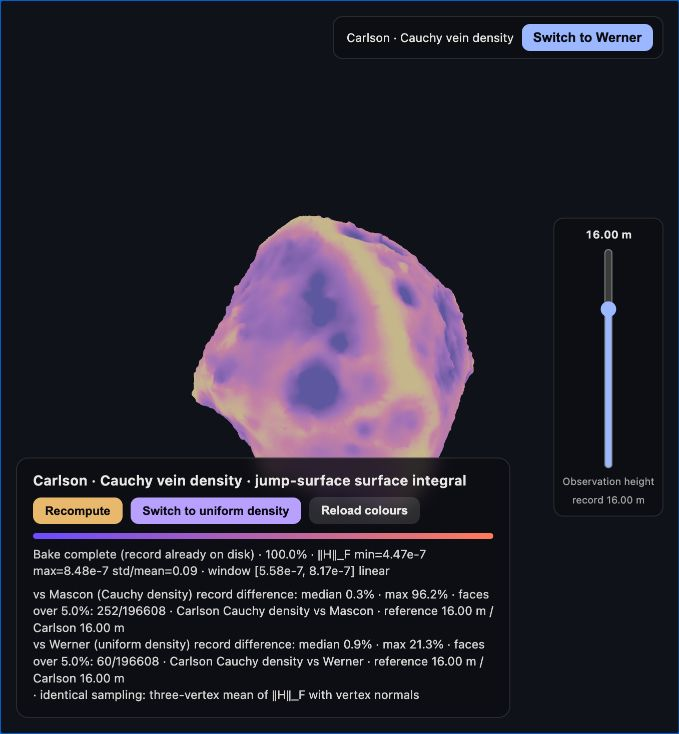
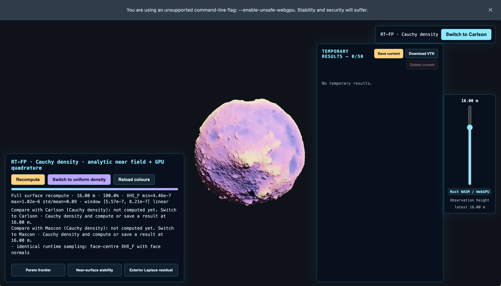
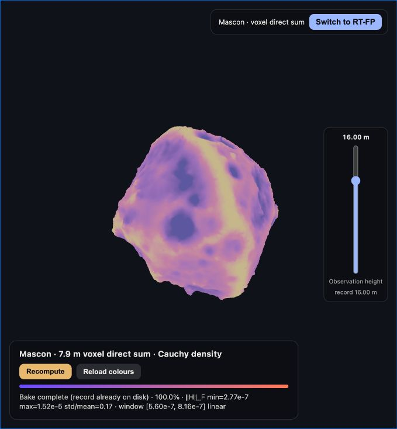
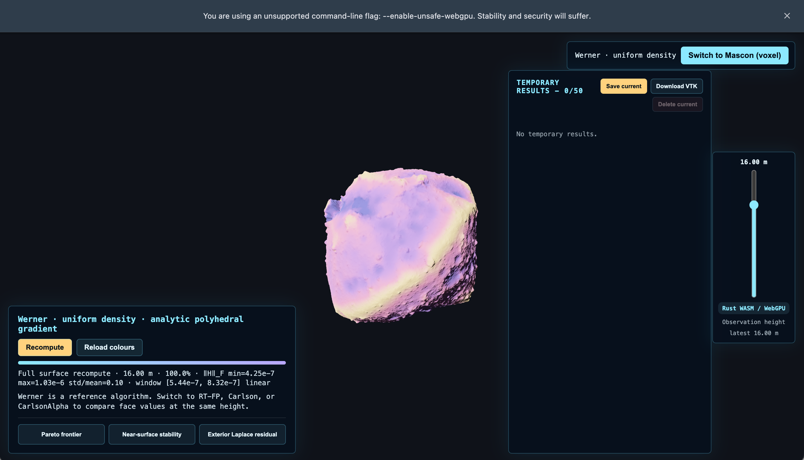
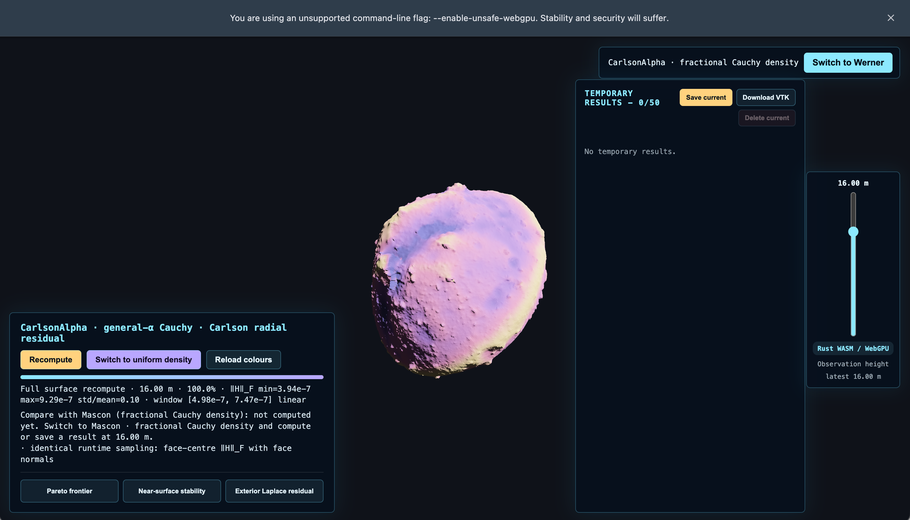
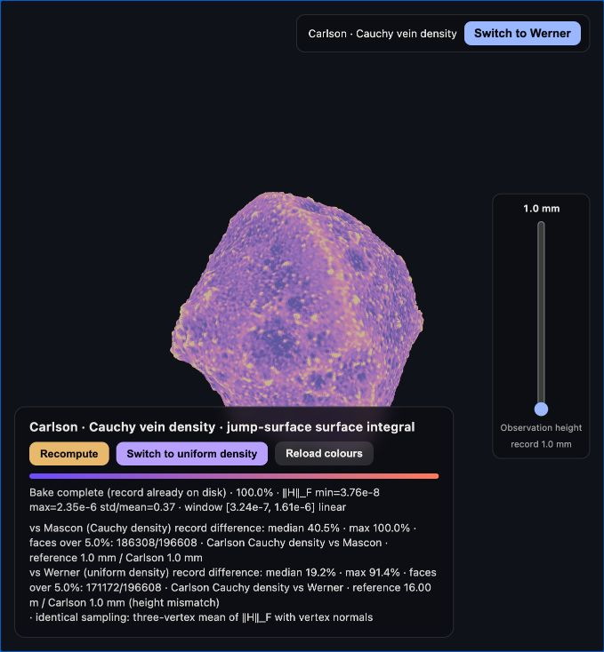
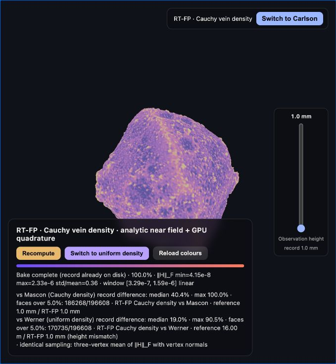
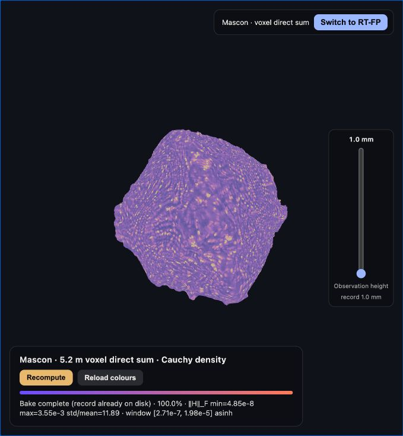

# Ryugu Cauchy Gravity

<p align="center">
  <a href="https://doi.org/10.5281/zenodo.22848069"></a>
  <a href="https://github.com/Tom-Jim/ryugu-cauchy-gravity"></a>
  <a href="https://www.rust-lang.org/"></a>
  <a href="https://bevy.org/"></a>
  <a href="https://bun.sh/"></a>
  <a href="https://www.w3.org/TR/webgpu/"></a>
  <a href="https://www.w3.org/TR/WGSL/"></a>
  <a href="https://vuejs.org/"></a>
  <a href="https://github.com/Tom-Jim/ryugu-cauchy-gravity/actions"></a>
</p>

<p align="center">
  <a href="https://tom-jim.github.io/ryugu-cauchy-gravity/"></a>
</p>

## Preview

The five algorithms use one observation surface, one RHGF face-record format,
one scalar colour window and one Bevy renderer. The images are solver
comparisons, not separate rendering pipelines.

| Carlson · Cauchy · 16 m | RT-FP · Cauchy · 16 m |
| :---: | :---: |
| [](docs/images/carlson-cauchy-16m.png) | [](docs/images/rtfp-cauchy-16m.png) |
| Mascon · Cauchy · 16 m | Werner · uniform · 16 m |
| [](docs/images/mascon-cauchy-16m.png) | [](docs/images/werner-uniform-16m.png) |

| CarlsonAlpha · fractional Cauchy · 16 m |
| :---: |
| [](docs/images/carlsonalpha-fractional-cauchy-16m.png) |

Low-altitude references:

| Carlson · Cauchy · 1 mm | RT-FP · Cauchy · 1 mm | Mascon · Cauchy · 1 mm |
| :---: | :---: | :---: |
| [](docs/images/carlson-cauchy-1mm.png) | [](docs/images/rtfp-cauchy-1mm.png) | [](docs/images/mascon-cauchy-1mm.png) |

## Scope

This repository compares five independent gravity-gradient computations for a
196,608-face model of asteroid (162173) Ryugu:

1. Werner: uniform-density polyhedral reference.
2. Mascon: runtime voxelisation and Barnes-Hut point-mass evaluation.
3. RT-FP: Cauchy-density radial finite-part path.
4. Carlson: continuous `alpha = 1` hybrid finite-part path with an exact
   `RC`-backed directional derivative and the nonzero spherical residual retained.
5. CarlsonAlpha: general positive-alpha hybrid path with analytic moving-endpoint
   terms and complete GL4/GL8/GL16 fixed-endpoint derivative rules.

The browser downloads only the GLB model, the two density TOML files and the
Rust/WASM/Vue static bundle. The server distributes files only; it performs no
numerical work. Every algorithm computes again after entry, with no shipped
precomputed solver record.

## Final mathematical conclusions

- The displayed scalar is the face-average of the Frobenius norm of the
  gravity-gradient tensor evaluated on the common offset observation surface.
- Werner, uniform RT-FP, uniform Carlson and uniform CarlsonAlpha are the
  common-density reference tracks and must agree up to floating-point and
  discretisation error.
- RT-FP Cauchy, Carlson Cauchy and Mascon Cauchy consume the same normalized
  `assets/density/cauchy.toml` field and total-mass convention.
- CarlsonAlpha fractional Cauchy and Mascon elliptic consume the same
  `assets/density/cauchy_elliptic.toml` field without silently replacing the
  exponents by `alpha = 1`.
- The browser Carlson backend contains real-domain `R_F`, `R_D`, `R_J`, and
  `R_C` implementations using Carlson duplication, homogeneous argument
  scaling, domain status and common-mean Taylor expansions. The exact
  `alpha=1` radial derivative uses the degenerate `R_C` branch. The uniform
  straight-triangle boundary is elementary, so it deliberately avoids an
  elliptic call. No unconnected quartic coefficient generator is shipped or
  presented as a production path.
- The identity `R_J(x, y, z, z) = R_D(x, y, z)` is used only when a generated
  fourth argument is actually `z`. Pole cancellation is never inferred from
  the identity alone.
- No unverified Möbius remapping, two-iteration universal truncation, or
  Fukushima-style minimax replacement is used in the production path.

## Validation status

The live GitHub Pages viewer is in a desktop WebGPU
browser at the default 16 m observation height. It completed all five solver
families and every density mode exposed by the UI.

The snapshot is a browser f32 consistency report, not a replacement for the
native f64 validation gates. In particular, timing values from the Pareto chart
are batch wall time per point (submission and readback included), and the
near-surface chart compares each candidate with a same-density browser
reference. No claim below should be read as an independent f64 accuracy proof.

At 16 m, the uniform-density tracks agree exactly at the displayed face-value
comparison precision: RT-FP, Carlson and CarlsonAlpha each report 0.00% median
and maximum difference against Werner. The Cauchy tracks report 0.33% (RT-FP)
and 0.34% (Carlson) median difference against the Mascon reference; the
fractional-Cauchy CarlsonAlpha track reports 0.34% against fractional Mascon.
The maximum and outlier-face counts remain in the detailed data file because
near-zero face values make those tail metrics much more sensitive than the
median.

## Architecture

```text
src/
├── rust/
│   ├── bin/                 Native CLI and self-checks
│   ├── compute/
│   │   ├── browser/         WebGPU coordination and dispatch
│   │   ├── native/          Native numerical reference code
│   │   └── source/          Runtime GLB and density construction
│   └── viewer/
│       ├── compute/         Viewer compute boundary
│       ├── frontend/        Session, temporary browser storage and Vue state
│       └── render/          Unified Bevy rendering
├── wgsl/compute/            Independent solver kernels
├── c++/                     Optional ESA reference bridge
└── web/                     Vue view, static server and build tools
```

There is one root `Cargo.toml`, one root `Makefile`, and one optional CMake
project under `src/c++`.

## Toolchain

- Rust and WGSL: Cargo and wasm-pack
- Vue and web tooling: Bun
- Optional ESA bridge: CMake
- Python is not required

```sh
make install
make build
make serve
make check
make test
make cpp
```

`make check` is source-only validation for formatting, Clippy and TypeScript.
The GitHub Actions workflow additionally builds the native crate, the WASM
viewer and the static GitHub Pages bundle.

## Density assets

- `assets/density/cauchy.toml`: normalized `alpha = 1` Cauchy stress field.
- `assets/density/cauchy_elliptic.toml`: fractional-Cauchy field with explicit
  positive exponents.
- `assets/models/ryugu.glb`: the only geometry input.

Generated `target/`, `pkg/`, `dist/` and `build/` directories are disposable.

## License

MIT
